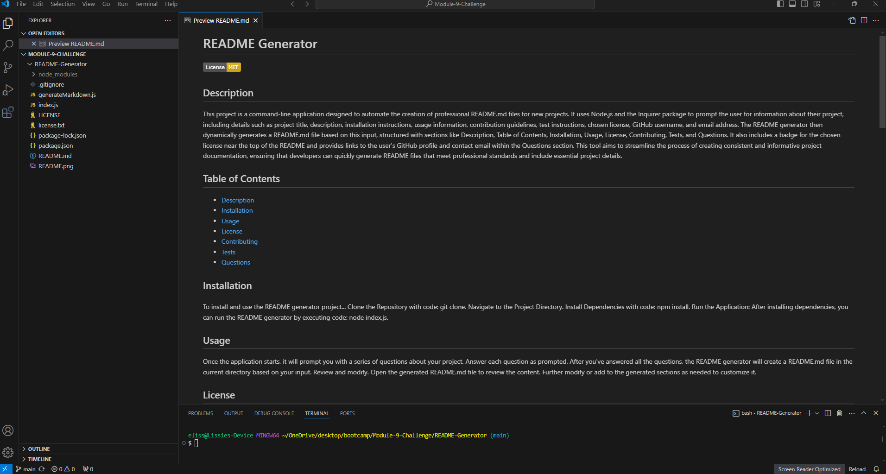

# README Generator

   

## Description

This project is a command-line application designed to automate the creation of professional README.md files for new projects. It uses Node.js and the Inquirer package to prompt the user for information about their project, including details such as project title, description, installation instructions, usage information, contribution guidelines, test instructions, chosen license, GitHub username, and email address. The README generator then dynamically generates a README.md file based on this input, structured with sections like Description, Table of Contents, Installation, Usage, License, Contributing, Tests, and Questions. It also includes a badge for the chosen license near the top of the README and provides links to the user's GitHub profile and contact email within the Questions section. This tool aims to streamline the process of creating consistent and informative project documentation, ensuring that developers can quickly generate README files that meet professional standards and include essential project details. 

## Table of Contents

- [Description](#description)
- [Installation](#installation)
- [Usage](#usage)
- [License](#license)
- [Contributing](#contributing)
- [Tests](#tests)
- [Questions](#questions)

## Installation

To install and use the README generator project... Clone the Repository with code: git clone. Navigate to the Project Directory. Install Dependencies with code: npm install. Run the Application: After installing dependencies, you can run the README generator by executing code: node index.js.

## Usage

Once the application starts, it will prompt you with a series of questions about your project. Answer each question as prompted. After you've answered all the questions, the README generator will create a README.md file in the current directory based on your input. Review and modify. Open the generated README.md file to review the content. Further modify or add to the generated sections as needed to customize it. 

## License

This project is licensed under the MIT 

## Contributing

Thank you for considering contributing to this project! Contributions are welcome and encouraged. Please follow these guidelines to contribute effectively: Fork the repository to your own GitHub account and clone it to your local machine. Create a branch for your feature or bug fix. Replace it with a descriptive branch name. Make your changes and ensure the code style follows the project's conventions. Test your changes thoroughly to ensure they work as expected. Commit to your changes with a clear and descriptive commit message. Push your changes to your forked repository. Go to the GitHub page of your forked repository and submit a pull request to the main branch of the original repository. Include a descriptive title and detailed description of your changes. Participate in the code review process by responding to feedback and making any necessary changes to your pull request. Feel free to open an issue to report bugs or suggest new features. Label issues appropriately (e.g., bug, enhancement) to help maintainers prioritize. Contributing to this project, you agree that your contributions will be licensed under the project's chosen license. See the License section in README.md for details. 

## Tests

To ensure that your project works as expected, follow these test instructions: Make sure all dependencies are installed with code: npm install.. You can manually test the application by entering various inputs when prompted to ensure that all questions are handled correctly with code: npm test.. After running the application, check the generated README.md file to ensure that all sections are correctly populated with the input data. Verify that the title, description, installation instructions, usage information, contribution guidelines, test instructions, license, GitHub username, and email address are accurately reflected in the README. Check License Badge: Ensure that the license badge is correctly displayed at the top of the README when a license is chosen. Click on the links in the Table of Contents to ensure they navigate to the correct sections within the README. Verify that the correct badge and license information are displayed. 

## Screenshot 

## Questions

For any questions, please contact me with the information below:

GitHub: [elissegomez24](https://github.com/elissegomez24)  
Email: elissegomez24@gmail.com

## Walkthrough Video 
https://drive.google.com/file/d/1Ph_W1lBaxeLy0nOHN8t-361pyK21oYjW/view 

> [!NOTE]  
> Resources used for adding to starter code. Referred back to class work for file format such as reviewing class recordings. Worked with peers and compared challenge template.
